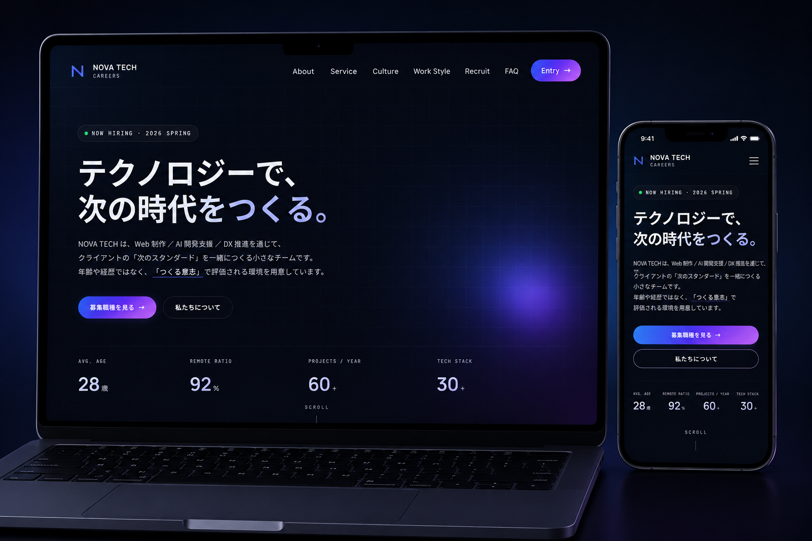

[README.md](https://github.com/user-attachments/files/28040630/README.md)
# NOVA TECH CAREERS — 採用 LP

> **テクノロジーで、次の時代をつくる。**
> 近未来系 IT 企業を想定した、架空企業の採用ランディングページ。

採用課題を解決する LP として、企画・設計・実装・公開までを一貫して担当したポートフォリオ作品です。「ただ綺麗なサイト」ではなく、応募数・応募者の質・エントリー完了率を改善することをゴールに据えて制作しました。



<p>
  
  
  
  
  
</p>

🔗 [**Live Site**](https://hirotonozaki.github.io/nova-tech-careers/) ／ [**Proposal Site**](https://hirotonozaki.github.io/nova-tech-careers-proposal/) ／ [**Repository**](https://github.com/hirotonozaki/nova-tech-careers)

---

## 📖 Overview ／ サイト概要

「NOVA TECH CAREERS」は、Web 制作・AI 開発支援・DX 推進を行う架空の IT 企業を想定した採用 LP です。
近未来的な世界観の中で、求職者が「何の会社か」「自分が働けるか」「次に何をすればいいか」を迷わず理解し、エントリーまで到達できる構造を 1 枚に凝縮しています。

| 項目 | 内容 |
| --- | --- |
| サイト種別 | 採用ランディングページ（架空企業） |
| コンセプト | テクノロジーで、次の時代をつくる。 |
| 構成 | シングルページ（縦スクロール完結型） |
| 対応デバイス | PC ／ タブレット ／ スマートフォン |
| 公開環境 | GitHub Pages |

---

## 🎯 Purpose ／ 制作目的

採用 LP の離脱は、ファーストビュー 3 秒以内に集中して発生します。
本サイトは「見栄えの良さ」ではなく、以下の指標を改善する LP として設計しました。

- ファーストビューでの価値訴求 → 不安解消 → エントリーまでの動線を 1 枚で完結させる
- 「合うか／働けるか」という求職者の不安を、文化・制度・社員の声で段階的に解消する
- 移動中のスマートフォン操作でもストレスなくエントリーできる状態をつくる

架空企業の案件ですが、「実在のクライアントから依頼されたつもりで設計する」を徹底し、ヒアリングシート・ペルソナ・KPI・サイトマップを言語化してからコードに進む手順を取っています。

---

## 👤 Target ／ 想定ターゲット

> 20 代後半 〜 30 代前半の **エンジニア／デザイナー**

「裁量のある環境・リモート・成長機会」を重視し、移動中にスマートフォンで複数社の採用情報を比較検討する層を中心に想定しています。

---

## 🎨 Design Concept ／ デザインコンセプト

**Apple × SaaS × Glass UI** — 情報密度を保ったまま、静かに先進性を伝えるビジュアル言語。

| 領域 | 方針 |
| --- | --- |
| Color | 背景 `#0a0b14` の漆黒をベースに、青紫グラデーション（`#5b8def → #8b5cf6 → #c084fc`）をアクセントに限定使用。黒の比重を 70% 以上に保つ |
| Typography | 欧文見出しに Manrope、本文に Noto Sans JP、UI・コードに JetBrains Mono を採用した和洋ペアリング |
| Glassmorphism | `backdrop-filter` をヘッダー・カード・ドロワーに限定適用。「全面ガラス」にせず近未来感と視認性を両立 |
| Motion | ヒーローのオーブを長周期で漂わせ、セクションはフェード＋わずかな Y 軸移動のみ。動きすぎず、無反応でもない手応え |

黒は単なる高級感ではなく、グラデーション・ガラス効果・数値を最大コントラストで際立たせる「土台」として機能させています。

---

## 🧭 UI / UX ／ 意識した点

- **迷わせない／迷っても戻れる** — ヘッダーに「トップへ戻る」「エントリーへ進む」を常駐させ、どの位置からも行動に接続できる
- **心理的負荷の最小化** — フォームはテキスト入力を減らし、タップで選べる UI を優先
- **アクセシビリティを「品位」として扱う** — セマンティック HTML・ARIA 属性・フォーカスリングを省略せず実装
- **段階的な信頼設計** — 数値指標 → 社員インタビュー → 募集要項の順で不安を解きほぐし、自然にエントリーへ繋ぐ

---

## 🛠 Implementation Highlights ／ 実装ポイント

実務で評価される「細部」を意識して実装しています。

| # | 項目 | 内容 |
| --- | --- | --- |
| 01 | FLOCSS / BEM 風命名 | `l-` `c-` `p-` `u-` プレフィックスで役割を分離し、複数人が触っても破綻しない設計 |
| 02 | CSS 変数によるトークン管理 | 配色・余白・タイポを `:root` に集約。デザイン調整を 1 箇所で完結 |
| 03 | IntersectionObserver | スクロール連動のフェードインを実装。一度可視化したら監視解除し CPU 負荷を抑制 |
| 04 | ハンバーガーメニュー | 開閉／ESC キー／外側タップ／リンク選択で閉じる動作と `aria-expanded` を同期 |
| 05 | Glassmorphism | `backdrop-filter` を限定使用。ドロワー背景は不透明にして可読性を確保 |
| 06 | SEO / OGP / JSON-LD | `title` / `description` 最適化、OGP 1200×630、Organization Schema を JSON-LD で配置 |
| 07 | アクセシビリティ | スキップリンク・`aria-label`・フォーカスリングを丁寧に。コントラスト比 WCAG AA 準拠 |
| 08 | prefers-reduced-motion | 動き軽減を希望するユーザーには全アニメーションを停止 |

```javascript
// Reveal — IntersectionObserver で一度だけフェードイン
const io = new IntersectionObserver((entries) => {
  entries.forEach((entry) => {
    if (entry.isIntersecting) {
      entry.target.classList.add('is-revealed');
      io.unobserve(entry.target); // 監視解除でコストを最小化
    }
  });
}, { rootMargin: '0px 0px -8% 0px', threshold: 0.12 });
```

---

## ⚙️ Tech Stack ／ 使用技術

フレームワークを使わず、**HTML / CSS / JavaScript のバニラ構成**を選定しました。
「将来 WordPress 化する前提」と「未経験でも保守できる範囲」のバランスを取った技術選定です。

| 領域 | 技術 |
| --- | --- |
| Markup | HTML5（セマンティック構造） |
| Styling | CSS3 / CSS Variables（Flexbox・Grid） |
| Interaction | JavaScript（ES6+、バニラ） |
| Font | Google Fonts（Manrope / Noto Sans JP / JetBrains Mono） |
| Hosting | GitHub Pages |
| Version Control | Git / GitHub |
| Design | Figma（ワイヤーフレーム） |

---

## 📱 Responsive ／ レスポンシブ対応

4 つのブレイクポイント（1340 / 1024 / 768 / 480）で構築し、「PC の縮小」ではなく「モバイル再設計」の発想で組んでいます。

- タッチ領域・親指リーチを基準にしたボタンサイズと余白
- モバイルではハンバーガーメニュー＋縦積みレイアウトに再構成
- DevTools のデバイスモードで主要 5 端末を毎コミット確認し、横スクロール 0 件・CLS 0.0000 を維持

---

## 🔍 SEO / OGP / Accessibility

| 項目 | 対応内容 |
| --- | --- |
| SEO | セマンティック HTML、`title` / `meta description` の最適化 |
| OGP | 1200×630 の OGP 画像を設定し、SNS シェア時の表示を最適化 |
| 構造化データ | Organization Schema を JSON-LD で記述 |
| アクセシビリティ | スキップリンク、`aria-*` 属性、フォーカスリング、WCAG AA 相当のコントラスト比 |
| モーション配慮 | `prefers-reduced-motion` に対応し、動き軽減設定を尊重 |

---

## 📂 Directory Structure ／ フォルダ構成

```
nova-tech-careers/
├── index.html          # トップページ（シングルページ構成）
├── style.css           # スタイル（FLOCSS / CSS 変数によるトークン管理）
├── script.js           # 挙動（Loader / Header / Drawer / Reveal ほか）
├── ogp.png             # OGP / SNS シェア用ビジュアル
└── assets/
    └── images/
        ├── preview-mockup.webp  # README ヒーロー用プレビュー（WebP 最適化）
        └── qr.png               # スマホアクセス用 QR
```

CSS / JS は将来の WordPress テーマ化を見据え、`./` 始まりの相対パスで統一しています。

---

## 🌐 Links ／ 公開 URL

| リソース | URL |
| --- | --- |
| Live Site | [hirotonozaki.github.io/nova-tech-careers](https://hirotonozaki.github.io/nova-tech-careers/) |
| Proposal Site | [hirotonozaki.github.io/nova-tech-careers-proposal](https://hirotonozaki.github.io/nova-tech-careers-proposal/) |
| Repository | [github.com/hirotonozaki/nova-tech-careers](https://github.com/hirotonozaki/nova-tech-careers) |
| Proposal Repository | [github.com/hirotonozaki/nova-tech-careers-proposal](https://github.com/hirotonozaki/nova-tech-careers-proposal) |

### 📲 Mobile Preview ／ スマホで確認

<p>
  
</p>

QR コードを読み取ると、スマートフォン実機でご確認いただけます。

---

## 🗓 Development ／ 制作期間

| 項目 | 内容 |
| --- | --- |
| 制作期間 | 約 4 週間（企画・設計・実装・公開） |
| 担当範囲 | 企画 / 情報設計 / UI デザイン / コーディング / 公開 |
| 制作年 | 2026 |

---

## 🚀 Future Work ／ 今後の改善案

- 応募フォームのバックエンド連携（送信処理・自動返信メール）
- Google Analytics 4 によるファネル計測と、ヒートマップでの行動分析
- 主要 CTA のコピー・配色・配置を対象とした A/B テスト運用
- 画像の遅延読み込み・WebP 化によるパフォーマンス最適化
- WordPress テーマ化による、採用情報の非エンジニア運用への移行

---

## 👤 Author ／ 制作者情報

| 項目 | 内容 |
| --- | --- |
| Name | Hiroto Nozaki |
| Role | Web Director / Front-end |
| Skills | HTML / CSS / JavaScript / WordPress / GitHub / UI Design |
| GitHub | [github.com/hirotonozaki](https://github.com/hirotonozaki) |
| Portfolio | [Live Site](https://hirotonozaki.github.io/nova-tech-careers/) ／ [Proposal Site](https://hirotonozaki.github.io/nova-tech-careers-proposal/) |

---

<sub>本サイトはポートフォリオ用に制作した架空企業の採用 LP です。掲載している企業情報・社員・数値はすべてフィクションです。</sub>
